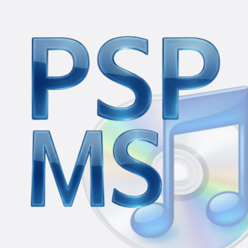
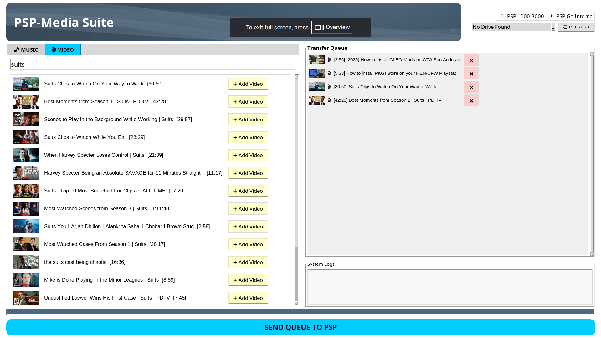

# PSP-Media-Suite
  
A media sync application to load music and videos from YT onto a USB connected PSP (1000/2000/3000/Go) easily.
Syncs quickly, no file conversions or extra steps needed. Supports Linux and Windows 




**Features**
1. Add Music or Videos to the queue to added to the PSP
2. Handles mix of Music and Videos to be synced, you can just select a bunch of music and videos together, hit send and grab a cup of tea, let it do its thing
3. Needs no conversions, mp3 and mp4 files are formatted for PSP
4. Supports Music Album art
5. Music will show up on XMB Music section
6. Videos would show up in XMB Video section

**HOW TO USE?**
- Open the PSP-MS (exe for windows, app package on Linux)
- Connect PSP using a USB Data cable and open "USB Connection" in PSP settings (left most section)
- Hit refresh on PSP-MS (top right), the device connection should show up with the remaining storage on the memory card (or internal storage in case of PSP go). You can manually choose PSP-Go's internal storage if you prefer, else itll default to the Memorystick
- Now select Music or Video, search your stuff and add to the queue. You can switch between Video and Music tabs while adding stuff to the queue, itll automatically sort them into mp3 and mp4
- Hit Send Queue to PSP, and let it do its thing, Music doesnt take long, Videos take less than 1/4th of the actual video duration (so a 4min long Music video would be downloaded, converted and sent within a minute)
- Done, unplug your psp and enjoy the stuff you downloaded in the Music and Video sections of the XMB
(NOTE)- Use this tool responsibly and do not download media that you dont own a license for.

# VIDEO DEMO (v1.3) ↓
[](https://youtu.be/JdQSQSG4Vfc)


# Build from source Instructions-
**WINDOWS USERS**
1. Open CMD and download the source- ```git clone https://github.com/vmg265/PSP-Media-Suite.git``` ```cd PSP-Media-Suite```
2. Download ffmpeg for windows here [https://www.gyan.dev/ffmpeg/builds/](https://www.gyan.dev/ffmpeg/builds/). Extract the ffmpeg.exe and place it in the root of your project folder (PSP-Media-Suite)
3. Install dependencies: Ensure Python 3.10+ is installed: ```pip install pyinstaller yt-dlp psutil Pillow requests mutagen```
4. Compile:``` python -m PyInstaller --onefile --windowed --icon=icon.ico --add-binary "ffmpeg.exe;." --add-data "banner.png;." --hidden-import PIL._tkinter_finder app.py```
5. After the compilation is done, the app.exe will be available in dist/ folder

**LINUX USERS**
1. Clone the repo- ```git clone https://github.com/vmg265/PSP-Media-Suite.git``` ```cd PSP-Media-Suite```
2. sudo apt install ffmpeg and copy the ffmpeg binary into your project folder (PSP-Media_Suite)
3. Install dependencies- ```pip3 install pyinstaller yt-dlp psutil Pillow requests mutagen```
4. Compile the executable- ```python3 -m PyInstaller --onefile --windowed --add-binary "ffmpeg:." --add-data "banner.png:." --hidden-import PIL._tkinter_finder app.py```
5. After compilation the app will be available in dist/ folder, to make it availble to your desktop, run- ```cp dist/app .``` ```bash install.sh```
