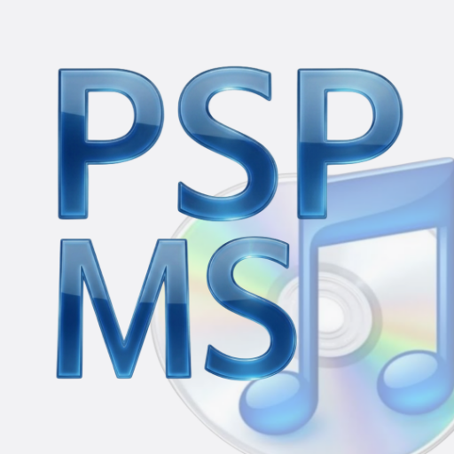
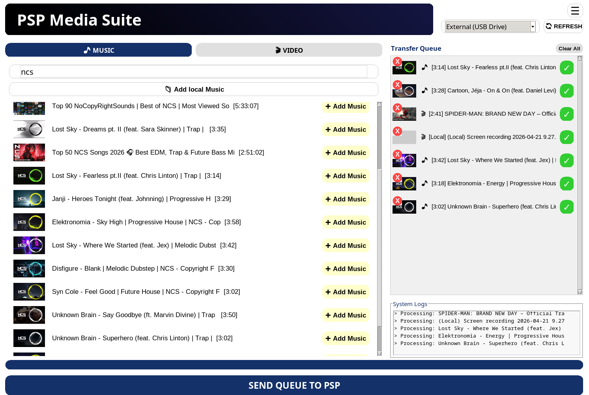
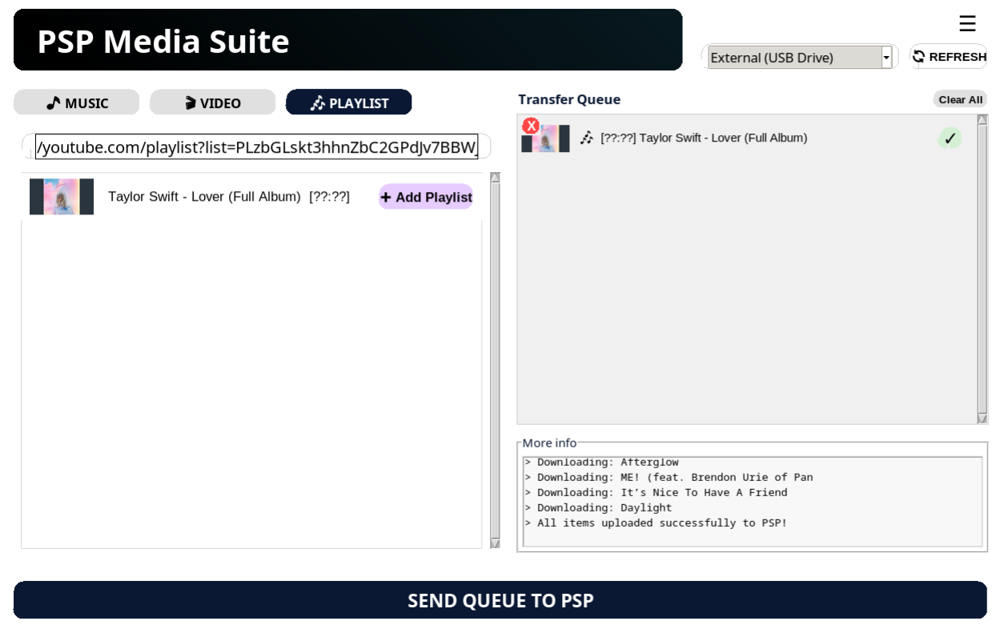

# PSP Media Suite
  
A media sync application to convert and load music, music playlists and videos from YT onto a USB connected PSP (1000/2000/3000/Go) or using a USB SD card reader easily.
Syncs quickly, no file conversions or extra steps needed. Supports Linux and Windows.   
<br>
<br>
Telegram Support Group: https://t.me/psp_mediasuite
<br>
<br>




**Features**
1. Add Music, Music Playlists and Videos to the PSP, with thumbnails for music, music playlists and videos.
2. Handles mix of Music and Videos to be synced, you can just select a bunch of music and videos together, hit send and grab a cup of tea, let it do its thing
3. Supports manually adding already downloaded music and video files from local storage 
4. Needs no conversions, mp3 and mp4 files are formatted for PSP
5. Supports Music Album art and Video thm files for thumbnails
6. Music will show up on XMB's Music section
7. Playlists will show up in XMB -> Music -> Playlist section
8. Videos would show up in XMB's Video section
9. Addded progress log in v1.4 which is now live. v1.4 also brings a slight ui redesign with 2 column view better suited for landscape devices.
10. v1.5 brings a cleaner ui experience and improvements both functional and aesthetic

**HOW TO USE?**
- Open the PSP-MS (exe for windows, app package on Linux)
- Connect PSP using a USB Data cable and open "USB Connection" in PSP settings (left most section)
- Hit refresh on PSP-MS (top right), the device connection should show up with the remaining storage on the memory card via psp's usb connection or a usb sd card reader (or internal storage in case of PSP go).
- Now select Music or Playlist or Video, search your stuff and add to the queue. You can switch between Video and Music tabs while adding stuff to the queue, itll automatically sort them into mp3 and mp4. Playlist support was added in v1.5 and they download as a single queue item
- Hit Send Queue to PSP, and let it do its thing, Music doesnt take long, Videos take less than 1/4th of the actual video duration (so a 4min long Music video would be downloaded, converted and sent within a minute)
- Done, unplug your psp and enjoy the stuff you downloaded in the Music and Video sections of the XMB
(NOTE)- Use this tool responsibly and do not download media that you dont own a license for.

# VIDEO DEMO (v1.3) ↓
[](https://youtu.be/JdQSQSG4Vfc)
(video shows v1.3, v1.4 and v1.5 brings new changes which you can learn about in the releases page)

# Build from source Instructions (TBU)-
**WINDOWS USERS**
1. Open CMD and download the source- ```git clone https://github.com/vmg265/PSP-Media-Suite.git``` ```cd PSP-Media-Suite```
2. Download ffmpeg for windows here [https://www.gyan.dev/ffmpeg/builds/](https://www.gyan.dev/ffmpeg/builds/). Extract the ffmpeg.exe and place it in the root of your project folder (PSP-Media-Suite)
3. Install dependencies: Ensure Python 3.10+ is installed: ```pip install pyinstaller yt-dlp psutil Pillow requests mutagen```
4. Compile:``` python -m PyInstaller --onefile --windowed --icon=icon.ico --add-binary "ffmpeg.exe;." --add-data "Icon.png;." --add-data "troubleshooter_box.txt;." --hidden-import PIL._tkinter_finder app.py```
5. After the compilation is done, the app.exe will be available in dist/ folder

**LINUX USERS**
1. Clone the repo- ```git clone https://github.com/vmg265/PSP-Media-Suite.git``` ```cd PSP-Media-Suite```
2. ```sudo apt install ffmpeg``` and copy the ffmpeg binary into your project folder (PSP-Media-Suite)
3. Install dependencies- ```pip3 install pyinstaller yt-dlp psutil Pillow requests mutagen```
4. Compile the executable- ```python3 -m PyInstaller --onefile --windowed --add-binary "ffmpeg:." --add-data "Icon.png:." --add-data "troubleshooter_box.txt:." --hidden-import PIL._tkinter_finder app.py```
5. After compilation the app will be available in dist/ folder, to make it availble to your desktop, run- ```cp dist/app .``` ```bash install.sh```


# To-do
- add sd card mount support (done in 1.4p)
- add music playlist capabilities (done in v1.5p)
- add a manual upload feature to send already downloaded mp3/mp4s (done in 1.5p)
- add a local view to see what videos and music is already on the storage device
